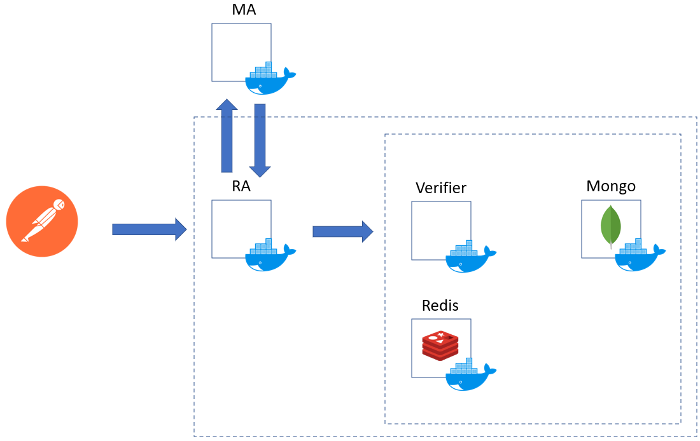

# CP-ABE PoC for accessing data in the cloud

PoC status: 🛠

**Fase de registro del dato**:
-	Postman: 
    - Envío de atributo
-	Contenedor Master Authority: 
    - Genera el par de claves
    - Es un servidor que está a la escucha de la solicitud para el envío de la clave pública
-	Contenedor Registration Authority:
    - Es un server que está a la escucha del postman
    - Cuando recibe el request via postman, recupera la clave pública.
    - Solicita NetworkID, el ContainerID y CollectionID al contenedor verifier para crear la policy
    - Lleva a cabo el cifrado usando AES
    - Envía el criptograma y la firma al contenedor verifier.
-	Contenedor verifier
    - Es un server que está a la escucha del RA.
    - Encargado de interactuar con el MongoDB
    - Responde a la solicitud de Networkid, Containerid y CollectionID
    - Asocia en el Contenedor Redis el CollectionID con el Access Token
-	Contenedor Redis
    - Mantiene la relación CollectionID – Access Token.
-	Contenedor MongoDB
    - Almacena el dato

**Fase de recuperación del dato**:
-	Postman:
    - Para envío de Access Token, ID Token
-	Contenedor Master Authority: 
    - Genera la clave usando MSK, A y el Access Token
    - Es un servidor que escucha la solicitud del Contenedor Registration Authority para el envío de la clave para hacer el descifrado.
-	Contenedor Registration Authority:
    - Es un server que está a la escucha del postman
    - Cuando recibe el request del Access Token, ID Token se verifica, que simplemente será verificar de un JSON.
    - Solicita la clave privada asociada al Token ID.
    - Le envía el Access Token al Contenedor verifier 
    - Espera a recibir CP
    - Aplica el descifrado usando SkA,i y CP.
    - Retorna el dato al postman.
-	Contenedor verifier
    - Es un server que está a la escucha del RA.
    - Verifica el Access Token
    - Consulta el Collection asociada al Access Token en la DB de Redis.
    - Recupera el dato asociado al Access Token.
-	Contenedor Redis
    - Mantiene la relación CollectionID – Access Token.
-	Contenedor MongoDB
    - Almacena el dato
